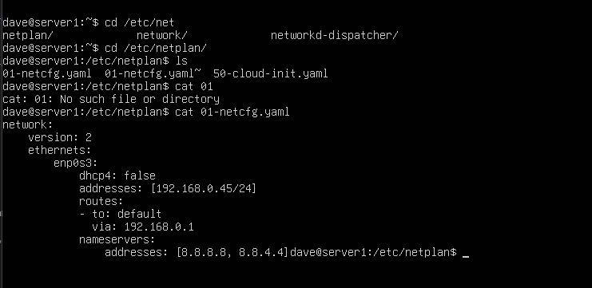

## Configuración de una IP estática en una máquina Ubuntu Server con VirtualBox.

### Paso 1: Configurar el Adaptador de Red en VirtualBox

1. **Abrir VirtualBox** y seleccionar la máquina virtual con Ubuntu Server.
2. Haz clic en **Configuración** y luego en la pestaña **Red**.
3. Selecciona un **Adaptador de red en puente** (Bridge Adapter) para que la máquina virtual obtenga acceso directo a la red local. Elige la interfaz de red que está conectada a tu red (por ejemplo, tu adaptador Ethernet o Wi-Fi).
4. Asegúrate de que esté marcada la opción **Cable conectado**.
5. Guarda los cambios.

### Paso 2: Identificar la interfaz de red en Ubuntu Server

Una vez que la máquina virtual esté configurada en VirtualBox:

1. Inicia sesión en la máquina virtual con **Ubuntu Server**.
2. Para ver el nombre de la interfaz de red, ejecuta el siguiente comando:

   ```bash
   ip addr
   ```

   El nombre de la interfaz será algo como `enp0s3`, `ens33`, o algo similar. Toma nota del nombre, ya que lo necesitarás en los pasos siguientes.

### Paso 3: Configurar la IP estática

Ubuntu Server usa **Netplan** para la configuración de red, que facilita la configuración de IP estáticas. Procede de la siguiente manera:

1. Abre el archivo de configuración de Netplan:

   ```bash
   sudo nano /etc/netplan/00-installer-config.yaml
   ```

   El contenido del archivo debería verse algo como esto si está configurado para DHCP:

   ```yaml
   network:
     ethernets:
       enp0s3:
         dhcp4: true
     version: 2
   ```
   
   Antes de pasar al caso siguiente, deberíamos de hacer una copia de dicho fichero.

2. Modifica el archivo para asignar una **IP estática**. Reemplaza `enp0s3` por el nombre de la interfaz que identificaste antes. Por ejemplo:
3. 

```yaml
  network:
    version: 2
    ethernets:
        enp0s3:
            dhcp4: false
            addresses: [192.168.0.45/24]
            routes:
            - to: default
              via: 192.168.0.1
            nameservers:
                addresses: [8.8.8.8, 8.8.4.4]
   ```




3. Guarda el archivo y cierra el editor.

### Paso 4: Aplicar los cambios

Una vez que hayas configurado el archivo YAML de Netplan, aplica los cambios con el siguiente comando:

```bash
sudo netplan apply
```

### Paso 5: Verificar la configuración

Después de aplicar los cambios, verifica que la configuración de red esté funcionando correctamente:

1. Comprueba la dirección IP asignada ejecutando:

   ```bash
   ip addr
   ```

2. Intenta hacer ping a otra máquina en la red o a Internet para verificar la conectividad:

   ```bash
   ping 8.8.8.8
   ```
